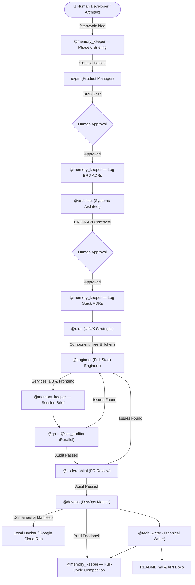
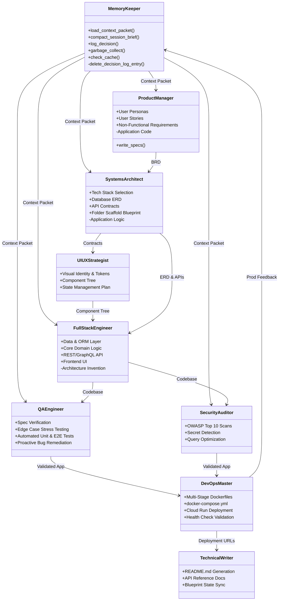

# 🏛️ Universal Master Workspace Blueprint v2.0 — Memory-Augmented Multi-Agent Pipeline

> **Classification**: Core Architectural Specification & Agent Operational Blueprint  
> **Target Audience**: AI Agents (Antigravity, Gemini, Claude, OpenAI Assistants, CodeRabbit, etc.) & Human Systems Architects  
> **Workspace Root**: `d:\TY-IT\Projects\Master_Skills`  
> **Version**: 2.0 — Memory-Augmented (supersedes v1.0)

---

## 1. Executive Summary & System Mission

The **Master_Skills** workspace is a standardized, enterprise-grade **Autonomous Multi-Agent Software Development & Delivery Framework**. It establishes a deterministic, role-segregated environment where specialized AI personas collaborate sequentially to convert high-level human ideas into hardened, production-ready, cloud-native applications.

### Core Architectural Axioms
1. **Strict Context Boundaries**: Each AI persona operates solely within its defined domain, preventing role hallucination and logic contamination.
2. **Approval Gates**: Critical architectural decisions and business requirement documents (BRDs) require explicit human sign-off before code generation begins.
3. **Artifact-Driven State Machine**: Agents pass context through persisted artifacts in designated folders rather than unbounded conversational memory.
4. **Zero-Regression & Surgical Precision**: Incremental changes must not disrupt existing schemas or application state.
5. **Fail-Fast Quality & Security Loops**: No application is deployed without passing static analysis, security auditing, and test coverage validation.
6. **Retrieval Over Re-reading (v2.0)**: An agent may not perform a full-file read of an artifact if `memory/context_index.yaml` already contains a valid (hash-matched) entry covering the needed information. Full-file reads are the fallback path, not the default path. Enforced by the Context Budget Governor (Section 8).



---

## 2. Universal Workspace Directory Hierarchy

The workspace is divided into five planes: **Control Plane** (agent instructions, skills, workflows), **Memory Plane** (indexed context, decision logs, session briefs, token accounting), **Data/Artifact Plane** (specifications, diagrams, audit reports), **Application Execution Plane** (source code, schemas, build artifacts), and **Deployment Plane** (production release artifacts).

```
Master_Skills/
├── .agents/                                # [CONTROL PLANE] Core AI Configuration & Personas
│   ├── agents.md                           # Master Persona Definitions (9 roles) & Operational Protocol v2
│   ├── skills/                             # Actionable Playbooks Executed by Roles
│   │   ├── write_specs.md                  # Spec & Architecture Blueprinting (PM/Architect/UIUX)
│   │   ├── generate_code.md               # Enterprise Code Generation (Engineer)
│   │   ├── audit_code.md                   # Static Analysis, QA & Security Hardening (QA/Sec)
│   │   ├── deploy_app.md                   # Local & Multi-Container Deployment (DevOps)
│   │   ├── deploy_cloud_run.md             # Production GCP Cloud Run Orchestration (DevOps)
│   │   └── manage_memory.md               # Context Retrieval, Compaction & Memory Management (Memory Keeper)
│   └── workflows/                          # Orchestrated Execution Pipelines
│       ├── startcycle.md                   # Greenfield End-to-End Pipeline (v2: with memory hooks)
│       └── iteratecycle.md                 # Surgical Iteration & Bugfix Loop (v2: indexed retrieval)
│
├── memory/                                 # [MEMORY PLANE] Persistent Cross-Phase Context (v2.0)
│   ├── context_index.yaml                  # Pointer index: topic → {file, line-range, hash, summary}
│   ├── decision_log.md                     # Append-only Architecture Decision Records (ADRs)
│   ├── session_briefs/                     # Per-agent per-phase compact digests (≤300 tokens each)
│   │   └── <cycle_id>_<agent>_<phase>.md
│   ├── token_ledger.csv                    # cycle_id, agent, phase, tokens_in, tokens_out, via_memory, timestamp
│   └── cache/                              # Keyed cache of idempotent/boilerplate outputs (hash → artifact)
│
├── artifacts/                              # [DATA PLANE] Generated Specifications & Audits
│   ├── task_lists/                         # Living Architecture Specs & State Files
│   │   └── Master_Blueprint.md             # Single Source of Truth for Active Architecture
│   └── audit_report.md                     # Security & QA Remediation Trail (Generated)
│
├── docs/                                   # [DESIGN & SPECS] Visual Identity & UI Contracts
│   ├── design_system.md                    # Color Palette, Typography & Tokens (Generated)
│   ├── component_tree.md                   # Frontend Hierarchy & State Layout (Generated)
│   └── api_specs/                          # OpenAPI / Swagger JSON/YAML specs
│
├── frontend/                               # [APP EXECUTION] Client-Side Web Application
│   ├── src/                                # Components, State Managers, Pages
│   ├── public/                             # Static Assets
│   └── package.json                        # Frontend Dependencies
│
├── services/                               # [APP EXECUTION] Backend Services & APIs (Generated)
│   ├── <service_name>/                     # Isolated Microservice / Backend Module
│   │   ├── src/                            # Controllers, Domain Services, Models
│   │   ├── pom.xml / requirements.txt      # Backend Dependency Declarations
│   │   └── Dockerfile                      # Multi-Stage Container Blueprint
│
├── database/                               # [APP EXECUTION] Relational / Document Schemas (Generated)
│   ├── migrations/                         # Incremental SQL Migration Scripts (V1__init.sql, etc.)
│   ├── schemas/                            # Raw DDL, Constraints, Indexes
│   └── seeds/                              # Local Mock / Test Seed Data
│
├── app_build/                              # [TEST & BUILD PLANE] Automation & Test Suites (Generated)
│   ├── tests/                              # Unit, Integration & Regression Test Suites
│   └── scripts/                            # Local Build & Lint Automation
│
└── production_artifacts/                   # [DEPLOYMENT PLANE] Production Release Artifacts (Generated)
    ├── docker-compose.yml                  # Multi-Container Local Orchestration
    ├── cloud_run_deploy.sh                 # Cloud Run Deployment Automation
    └── env_templates/                      # Sanitized .env.example templates
```

---

## 3. Directory Taxonomy & Rules of Engagement

| Directory | Owner Role(s) | Read Access | Write Access | Purpose & Invariant Rules |
|---|---|---|---|---|
| `.agents/` | System Admin | All Agents | System Only | Contains immutable persona definitions, skill playbooks, and workflow definitions. Agents MUST NOT modify this directory during runtime. |
| `memory/` | `@memory_keeper` | All Agents | `@memory_keeper` only | **[v2.0]** Stores the context index, ADR log, session briefs, token ledger, and idempotent-output cache. **Rule:** Append/supersede only in `decision_log.md` — never delete. All other agents read from here before reading raw artifacts. |
| `artifacts/task_lists/` | `@pm`, `@architect` | All Agents | `@pm`, `@architect`, `@tech_writer` | Stores the canonical `Master_Blueprint.md`. Must be kept strictly synchronized with the application reality. |
| `artifacts/` | `@qa`, `@sec_auditor` | All Agents | `@qa`, `@sec_auditor` | Stores generated test logs, vulnerability scans, and `audit_report.md`. |
| `docs/` | `@uiux`, `@tech_writer` | All Agents | `@uiux`, `@tech_writer` | Stores UI/UX design tokens, component hierarchies, wireframes, and API documentation. |
| `database/` | `@architect`, `@engineer` | All Agents | `@engineer` | Contains database DDL, ORM mappings, and incremental migrations. **Rule:** Never drop tables in production; use incremental SQL scripts. |
| `services/` | `@engineer`, `@qa` | All Agents | `@engineer`, `@qa` (fixes) | Contains domain logic, service layers, and REST/GraphQL controllers. **Rule:** No placeholder comments (`// TODO`, `pass`). |
| `frontend/` | `@uiux`, `@engineer` | All Agents | `@engineer` | Houses the frontend application. Strictly adheres to tokens in `docs/` and API endpoints in `Master_Blueprint.md`. |
| `app_build/` | `@qa` | All Agents | `@qa` | Contains automated test suites (`tests/`), test harnesses, and validation fixtures. |
| `production_artifacts/` | `@devops` | All Agents | `@devops` | Contains `Dockerfile`, `docker-compose.yml`, and Cloud Run manifests. **Rule:** Never commit secrets or un-sanitized `.env` files. |

---

## 4. Multi-Agent Roster & Responsibilities (`.agents/agents.md`)

Each AI agent operating in this repository must identify its active persona and strictly obey the boundaries below:



### Agent Detailed Profiles

> **Note**: Persona numbering below reflects **execution priority** (Memory Keeper runs first in every phase), not definition order in `.agents/agents.md` where `@memory_keeper` appears after the original 8 personas.

1. **`@memory_keeper` (Context Steward)** — *v2.0*
   - **Mandate**: Owns the Memory Plane. Runs twice per phase — once before (briefing) and once after (compaction) every other agent's turn. Eliminates redundant full-file reads, preserves architectural decisions across cycles, and enforces token budgets.
   - **Key Artifacts**: `memory/context_index.yaml`, `memory/decision_log.md`, `memory/session_briefs/`, `memory/token_ledger.csv`, `memory/cache/`.
   - **Hard Rules**:
     - Never deletes a `decision_log.md` entry — supersede, don't erase.
     - Never lets a full-file read pass silently once it exceeds the Context Budget Governor threshold — must attach a one-line justification.
     - Owns garbage collection of stale session briefs (10-cycle retention) so `memory/` itself doesn't become the next token sink.

2. **`@pm` (Product Manager)**
   - **Mandate**: Translates vague user ideas into structured Business Requirements Documents (BRDs).
   - **Key Artifact**: `artifacts/task_lists/Master_Blueprint.md` (Phase 1).
   - **Hard Rule**: Must halt for user approval before moving to Systems Architecture.

3. **`@architect` (Systems Architect)**
   - **Mandate**: Designs scalable data models (ERDs), API contracts (OpenAPI/Swagger), and directory blueprints.
   - **Key Artifact**: `artifacts/task_lists/Master_Blueprint.md` (Phase 2).
   - **Hard Rule**: Does not write application logic; provides exact specs for the Engineer.

4. **`@uiux` (UI/UX Strategist)**
   - **Mandate**: Defines visual identity, typography, color palettes, responsive layouts, and component trees.
   - **Key Artifact**: `docs/design_system.md` & `docs/component_tree.md`.
   - **Hard Rule**: Focuses on design tokens and component hierarchy before frontend implementation.

5. **`@engineer` (Full-Stack Engineer)**
   - **Mandate**: Implements end-to-end working software across `database/`, `services/`, and `frontend/`.
   - **Core Rules**:
     - Follows SOLID principles, strict typing, and defensive programming.
     - Never leaves stubs, placeholders (`// TODO`), or unhandled exceptions.
     - Implements structured logging and standardized HTTP responses.
     - Checks `memory/cache/` before generating boilerplate.

6. **`@qa` (QA Engineer)**
   - **Mandate**: Verifies business logic against the BRD, creates test suites in `app_build/tests/`, and executes test suites.
   - **Hard Rule**: Proactively fixes broken code in place rather than just reporting errors. Runs concurrently with `@sec_auditor` in Phase 3.

7. **`@sec_auditor` (Security Auditor)**
   - **Mandate**: Scans for OWASP Top 10 vulnerabilities, validates zero hardcoded credentials, and checks SQL parameterization.
   - **Key Artifact**: `artifacts/audit_report.md`.
   - **Hard Rule**: Halts pipeline if critical security flaws are detected. Runs concurrently with `@qa` in Phase 3.

8. **`@devops` (DevOps Master)**
   - **Mandate**: Containerizes services using multi-stage `Dockerfile`s, configures `docker-compose.yml`, handles GCP Cloud Run rollouts, and verifies live health checks.
   - **Key Artifact**: `production_artifacts/` configurations.
   - **Hard Rule**: Idempotent operations only; never commit secrets. Emits production feedback data (deployment status, error rates, latency, crash-loop signals) to `@memory_keeper`, who writes the production session brief to `memory/session_briefs/` for closed-loop observability.

9. **`@tech_writer` (Technical Writer)**
   - **Mandate**: Generates developer-friendly `README.md`, local setup guides, API specs, and keeps `Master_Blueprint.md` synchronized with the live codebase.

---

## 5. Workflow Pipelines & Execution Sequences

### 5.1 Greenfield Workflow: `/startcycle <idea>` (`.agents/workflows/startcycle.md`)

Used to bootstrap a brand-new project from scratch.

```
Phase 0: Memory Briefing (v2.0)
  0. [@memory_keeper] manage_memory.md ──► Load context_index + last 3 session_briefs + open ADRs → Context Packet

Phase 1: Ideation & Architecture
  1.  [@pm] write_specs.md ──────────────► BRD Draft (uses Context Packet, not full-file reads)
      └─► [GATE 1: Wait for User Approval]
  1a. [@memory_keeper] ─────────────────► Log BRD decisions to decision_log.md, index new artifacts
  2.  [@architect] ──────────────────────► ERD, API Contracts, Stack
      └─► [GATE 2: Wait for User Approval]
  2a. [@memory_keeper] ─────────────────► ADR for stack/schema choices, index refresh

Phase 2: Implementation & Guardrails
  3.  [@uiux] ───────────────────────────► Design Tokens & Component Tree (uses Architect's session brief)
  3a. [@memory_keeper] ─────────────────► Index docs/design_system.md & component_tree.md, session brief
  4.  [@engineer] generate_code.md ──────► database/ -> services/ -> frontend/ (checks memory/cache/ first)
  4a. [@memory_keeper] ─────────────────► Session brief for this phase, index refresh

Phase 3: Extreme Validation (Parallel — v2.0)
  5a. [@qa] audit_code.md       ┐
  5b. [@sec_auditor]            ┴───────► Run CONCURRENTLY against diff + session_brief, not full repo
      └─► [CONDITIONAL LOOP: If failure -> return to Step 4]
  6.  [CodeRabbit] ──────────────────────► PR Review & Confidence Check

Phase 4: Delivery
  7.  [@devops] deploy_app.md ───────────► Dockerfiles, Compose, Cloud Run Deploy (cache-aware)
  8.  [@tech_writer] ────────────────────► README.md, API Documentation, Summary
  9.  [@memory_keeper] ──────────────────► Full-cycle compaction, garbage collection, ledger review
```

### 5.2 Surgical Iteration Workflow: `/iteratecycle <request>` (`.agents/workflows/iteratecycle.md`)

Used for non-destructive updates, incremental feature additions, and bug fixes.

> **v2.0 key difference**: A one-line bugfix now costs one indexed lookup + a scoped diff read — not a full-repository re-ingestion.

```
Phase 0: Memory Briefing (v2.0 — the critical savings phase)
  0. [@memory_keeper] ──────────────────► Retrieve ONLY index entries + ADRs matching <request> keywords
                                           (skip the full Master_Blueprint.md read entirely)

Phase 1: Impact Analysis
  1. [@pm] ──────────────────────────────► Read Context Packet → artifacts/task_lists/Feature_Update_Spec.md
  2. [@architect] ───────────────────────► Locate exact files/schemas via context_index.yaml pointers
     └─► [GATE: Wait for User Approval]

Phase 2: Surgical Implementation
  3.  [@engineer] ───────────────────────► Modify ONLY targeted files; check cache/ before generating boilerplate
  3a. [@memory_keeper] ─────────────────► Session brief for Engineer's changes, index refresh

Phase 3: Regression Auditing (Parallel — v2.0)
  4a. [@qa]            ┐
  4b. [@sec_auditor]   ┴────────────────► Run concurrently against the diff + session_brief

Phase 4: Sync, Memory Commit & Deployment
  5. [@tech_writer] ─────────────────────► Sync Master_Blueprint.md & README.md
  6. [@memory_keeper] ──────────────────► New ADR(s), index refresh, session_brief, ledger entry, GC
  7. [@devops] ──────────────────────────► Deploy with traffic splitting (e.g., 10% canary)
                                           Emit prod feedback → @memory_keeper writes session_brief
```

---

## 6. Skills Playbook Reference (`.agents/skills/`)

| Skill File | Description | Execution Sequence |
|---|---|---|
| [`manage_memory.md`](file:///d:/TY-IT/Projects/Master_Skills/.agents/skills/manage_memory.md) | **[v2.0]** Context retrieval, compaction, ADR management, token accounting, garbage collection, and semantic caching. | 1. Pre-Phase Retrieval (Context Packet ≤4,000 tokens)<br>2. Post-Phase Compaction (session briefs, ADRs, index refresh)<br>3. Token Accounting (ledger + budget violation flagging)<br>4. Garbage Collection (10-cycle retention, hash re-validation)<br>5. Semantic Cache (hash-keyed boilerplate reuse) |
| [`write_specs.md`](file:///d:/TY-IT/Projects/Master_Skills/.agents/skills/write_specs.md) | Translates raw input to `artifacts/task_lists/Master_Blueprint.md`. | 1. PM BRD (Personas, Stories, NFRs)<br>2. Architect Foundation (Stack, ERD, API Contracts, Tree)<br>3. UI/UX Strategy (Design system, State)<br>4. Approval Gate Prompt |
| [`generate_code.md`](file:///d:/TY-IT/Projects/Master_Skills/.agents/skills/generate_code.md) | Enterprise-grade full-stack code generator. | 1. Data Layer (`database/` SQL & ORM Entities)<br>2. Core Business Logic (Domain services & custom exceptions)<br>3. API & Controllers (REST/GraphQL + Exception Handlers)<br>4. Frontend Implementation (State management & UI components)<br>5. Dependency Manifests |
| [`audit_code.md`](file:///d:/TY-IT/Projects/Master_Skills/.agents/skills/audit_code.md) | Universal code audit, test suite generation, and security hardening. | 1. Contract & Architecture Spec Alignment<br>2. Static Analysis & Bug Hunting<br>3. Security & OWASP Profiling<br>4. Proactive Code Overwrite & `artifacts/audit_report.md`<br>5. CodeRabbit PR review compliance |
| [`deploy_app.md`](file:///d:/TY-IT/Projects/Master_Skills/.agents/skills/deploy_app.md) | Universal multi-service build and container orchestration. | 1. Secrets & `.env.example` Bootstrapping<br>2. Multi-stage `Dockerfile` & `docker-compose.yml`<br>3. Native/Docker Build & Schema Migrations<br>4. Service Launch & Health Check Pings<br>5. User Handoff with URLs & log commands |
| [`deploy_cloud_run.md`](file:///d:/TY-IT/Projects/Master_Skills/.agents/skills/deploy_cloud_run.md) | Production-grade deployment to Google Cloud Run. | 1. GCP API & Service Account Principle of Least Privilege<br>2. Secret Manager & Cloud SQL Auth Proxy Setup<br>3. Cloud Build Container Compilation & Artifact Registry Push<br>4. `gcloud run deploy` with Traffic Splitting<br>5. Health Check & Cloud Logging Verification |

---

## 7. AI Agent Operational Protocol v2.0 & Checklist

Any AI agent entering this workspace MUST follow this operational protocol:

### Step 0: Memory-First Context Load (mandatory — runs before any work)
Before reading any raw file in full, query `memory/context_index.yaml` for entries matching your current task's keywords. Pull the most recent 1–3 relevant `memory/session_briefs/*.md` and any open ADRs from `memory/decision_log.md`. Only perform a full-file read when the index has no matching entry, or the entry's hash no longer matches the file. Log any full-file read exceeding the Context Budget Governor threshold (4,000 tokens) with a one-line justification.

### Step 1: Discover State
- Check `artifacts/task_lists/Master_Blueprint.md` (via indexed summary first) to understand existing schemas, endpoints, and architectural patterns.
- Check `docs/` for existing design system tokens and component trees.
- Check `database/` and `services/` to inspect active code and dependencies.

### Step 2: Determine Workflow Trigger
- If starting a new system: Trigger `/startcycle <idea>` → Follow `.agents/workflows/startcycle.md`.
- If modifying an existing feature or fixing a bug: Trigger `/iteratecycle <target>` → Follow `.agents/workflows/iteratecycle.md`.

### Step 3: Strictly Obey Persona Phase Order
- Never jump straight to coding (`generate_code.md`) before Phase 1 architecture and specs are signed off by the user.
- Always implement the database/domain layer first, API routing second, and frontend third.
- Never declare a task complete without running the QA and Security audit steps (`audit_code.md`).

### Step 4: Adhere to Code Quality Invariants
- ❌ **Forbidden**: `// TODO`, `pass`, placeholder comments, hardcoded secrets, `DROP TABLE` in iteration cycles.
- ✅ **Mandatory**: Parameterized SQL queries, structured error handling, clean module boundaries, 100% functional implementations.

### Step 5: Memory Commit (mandatory — runs after every phase)
Emit a `session_brief` (≤300 tokens): what changed, what's open for the next agent. If the phase produced an architectural, schema, or contract decision, append an ADR to `memory/decision_log.md` — never edit or delete prior entries, only supersede. Refresh `memory/context_index.yaml` for any files you touched. Append your token usage to `memory/token_ledger.csv`.

---

## 8. Context Budget Governor

A configurable per-invocation ceiling on raw (non-indexed) file content an agent may load. This is the enforcement mechanism behind Axiom 6 — without a numeric ceiling, "retrieval over re-reading" is a suggestion agents will quietly ignore.

| Parameter | Value | Location |
|---|---|---|
| Default threshold | **4,000 tokens** | `memory/context_index.yaml` → `context_budget_governor_tokens` |
| Tuning data source | `memory/token_ledger.csv` | Review after ~5 cycles to calibrate |
| Enforcement agent | `@memory_keeper` | Flags violations, does not hard-block |

**When a full-file read is necessary**: The agent must include a one-line justification (e.g., "Index entry hash mismatch — file modified outside pipeline") in its output. `@memory_keeper` logs the violation in the token ledger for human review.

---

## 9. Model Tiering Guidance

Framework-agnostic guidance — applies whether running Claude, Gemini, GPT-class, or any other model family.

| Task Type | Suggested Tier | Rationale |
|---|---|---|
| Memory indexing, compaction, doc sync | Fast / Lightweight | High-frequency, low-creativity, formulaic |
| QA test generation, security scanning | Mid tier | Bounded reasoning scope |
| Architecture, schema design, BRDs | Frontier / Flagship | Low-frequency, high-stakes, needs strongest reasoning |
| Boilerplate (CRUD, Dockerfiles) | Fast tier + cache-first | Highly repetitive; cache hit beats regeneration |

---

## 10. Handoff Schema Contracts

To reduce ambiguity at phase boundaries (which forces re-reads to clarify intent), critical handoffs use a machine-checkable JSON schema alongside the narrative artifacts.

**Example: Architect → Engineer handoff**
```json
{
  "phase": "architect_to_engineer",
  "schema_version": 1,
  "api_contracts": [
    {
      "path": "/orders",
      "method": "POST",
      "request_schema_ref": "docs/api_specs/orders.yaml#/POST"
    }
  ],
  "erd_ref": "memory/context_index.yaml#user_auth_schema",
  "decision_refs": ["ADR-014"],
  "cache_hints": ["crud_controller", "dockerfile_python"]
}
```

These schemas supplement — not replace — the narrative spec documents. They provide agents with unambiguous pointers to the exact artifacts they need, reducing the "read everything to find what matters" anti-pattern.

---

## 11. Closed-Loop Observability

To prevent each `/iteratecycle` from starting "blind" to how the last release actually performed:

1. **`@devops`** writes a `session_brief` from production logs/health checks after every deployment.
2. This brief includes: deployment status, error rates, latency metrics, and any crash-loop or degradation signals.
3. The next `/iteratecycle` Phase 0 automatically picks up this brief via `@memory_keeper`'s context retrieval, giving `@pm` and `@architect` production-informed context before they scope the next change.


---

*Authored for Universal AI Agent Interoperability & Seamless Multi-Agent Orchestration.*  
*v2.0 — Memory-Augmented Multi-Agent Pipeline — 2026-08-30*
