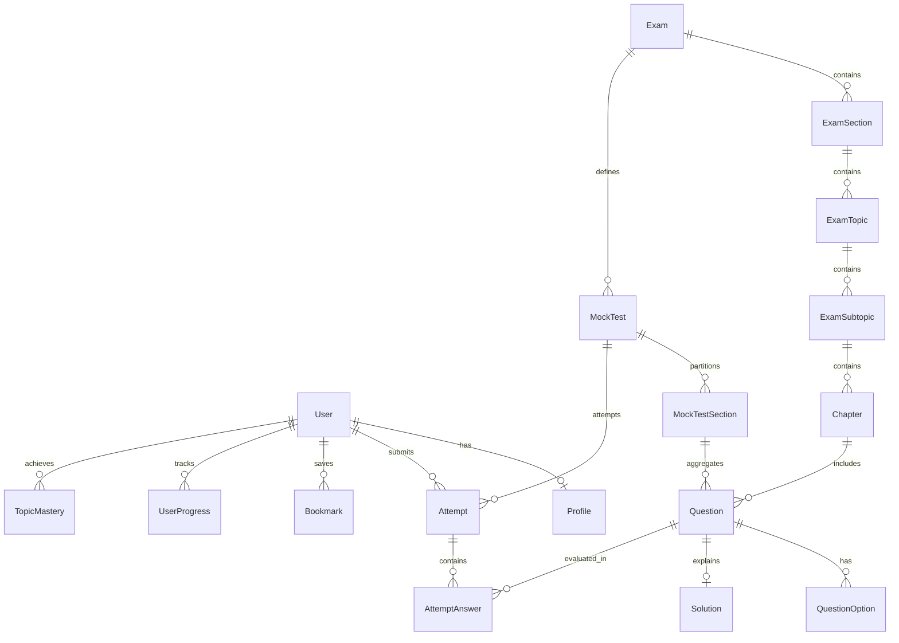

# 🏛️ AptiVerse Master Architectural Blueprint v2.0
> **System Name**: AptiVerse Intelligent Exam Preparation Platform  
> **Workspace Root**: `d:\TY-IT\Aptiverse`  
> **Status**: Active Architecture / Ideation & Architecture Approved Review  
> **Version**: 2.0 (Memory-Augmented Multi-Agent Pipeline)  
> **Target Audience**: AI Personas (@pm, @architect, @uiux, @engineer, @qa, @sec_auditor, @devops, @tech_writer, @memory_keeper) and Human Architects

---

## 1. Executive Summary & Core Mission

**AptiVerse** is a high-performance, enterprise-grade competitive examination preparation and diagnostic platform engineered specifically for premier management and aptitude entrance exams (CAT, XAT, GMAT, SNAP, NMAT, CMAT, MAT, MAH MBA CET). 

The platform bridges pedagogical rigor with real-time test simulation fidelity:
1. **Zero-Leak Timed Mock Simulation Engine**: Exact sectional countdowns, automated section locks, MCQ/TITA input interfaces, and strict zero-client-leak verification where answers and full solutions remain server-side until explicit attempt finalization.
2. **Pedagogical Taxonomy & Dynamic Curriculum**: Multi-tier hierarchy (`Exam` → `Section` → `Topic` → `Subtopic` → `Chapter`) with structured concept modules, step-by-step derivation solutions, and shortcut methods.
3. **Targeted Practice & Diagnostic Remediation**: Adaptive quizzes, daily streak mechanics, a dedicated "Mistakes Notebook" automatically capturing errors, and speed-vs-accuracy quadrant diagnostics.
4. **Mastery Telemetry & Gamification**: Topic-level mastery curves, percentile approximations, XP rewards, milestone badges, and global/cohort leaderboards.

---

## 2. Target User Personas & User Stories

### User Personas
- **P1: Exam Aspirant (Student)**: Needs high-fidelity mock environments matching actual exam patterns, instant score breakdowns, weak area diagnosis, and structured practice.
- **P2: Content Reviewer / Subject Matter Expert**: Curates and verifies question banks, writes detailed solutions, tags concepts and difficulty levels.
- **P3: Platform Administrator**: Configures mock schedules, manages exam syllabi, monitors system health and user analytics.

### User Stories
- **US-01 [Mock Engine]**: *As a Student*, I want to take full-length mock exams with exact sectional timers and non-reversible transitions so that I experience real test-day pressures.
- **US-02 [TITA & MCQ Support]**: *As a Student*, I want to answer both Type-In-The-Answer (TITA) and 4/5-option MCQs with exam-specific negative marking rules (+3/-1 for CAT MCQs, 0 for TITA).
- **US-03 [Exam Palette & Navigation]**: *As a Student*, I want an interactive question palette displaying status (Not Visited, Not Answered, Answered, Marked for Review, Answered & Marked for Review) and quick filtering.
- **US-04 [Diagnostic Report]**: *As a Student*, I want immediate post-test analytics detailing sectional scores, accuracy %, time spent per question, and comparative benchmarks.
- **US-05 [Mistakes Notebook]**: *As a Student*, I want all my incorrect and unattempted questions saved to a personalized Mistakes Notebook so I can re-attempt them.
- **US-06 [Chapter Practice]**: *As a Student*, I want to practice specific topics (e.g., Quantitative Aptitude -> Arithmetic -> Time & Work) with progressive difficulty.
- **US-07 [Zero-Leak Security]**: *As an Educator*, I want test answers and explanations to remain strictly confidential on the server until student test submission.

### Non-Functional Requirements (NFRs)
- **Response Latency**: Palette navigation, question selection, and answer marking < 50ms locally; API response time for answer persistence < 120ms.
- **Session Durability**: Local state caching via `localStorage` with periodic background sync to handle sudden disconnections or accidental browser refreshes without time or answer loss.
- **Data Integrity**: Relational constraints and atomic transactions for exam submission and attempt scoring.
- **Accessibility & Devices**: Full desktop fidelity for mock tests; fully responsive PWA layout for practice, flashcards, and analytics on mobile/tablet.

---

## 3. Technology Stack Specification

| Tier | Technology | Specification / Rationale |
|---|---|---|
| **Frontend Framework** | Next.js 15+ / React 19 | App Router, Server Components for high SEO, Client Components for dynamic test engines |
| **Language & Runtime** | TypeScript 5+ & Node.js v20+ | End-to-end type safety, strict interface contracts |
| **Styling & Design System** | Tailwind CSS v4 + Lucide React | Modern dark/light glassmorphic UI, harmonious slate/indigo/amber palette, fluid micro-interactions |
| **Animation & Transitions** | Framer Motion | Smooth transitions for modals, mock palettes, and celebration/mastery feedback |
| **Data Visualization** | Recharts | Radar charts for topic mastery, scatter plots for speed vs accuracy, historical trend lines |
| **Database & ORM** | Prisma ORM 7 + SQLite / PostgreSQL | Zero-config standalone SQLite (`dev.db`) for rapid local execution, seamless migration to PostgreSQL |
| **State Management** | Zustand & LocalStorage Sync | Resilient, atomic client-side state machine for the mock test engine |
| **Authentication & Security** | Web Crypto / PBKDF2 + HTTP-only JWT | Secure hashed credentials, role-based protection (`STUDENT`, `REVIEWER`, `ADMIN`) |

---

## 4. Entity-Relationship Data Architecture (`prisma/schema.prisma`)



### Core Entities:
1. **User**: `id`, `name`, `email`, `passwordHash`, `role` (STUDENT | REVIEWER | ADMIN), `createdAt`, `updatedAt`
2. **Profile**: `id`, `userId`, `targetExam`, `targetYear`, `streakDays`, `xp`, `level`, `bio`, `avatarUrl`
3. **Exam**: `id`, `slug`, `title`, `description`, `icon`, `totalMarks`, `totalDurationMins`, `isActive`
4. **ExamSection**: `id`, `examId`, `title`, `slug`, `order`, `durationMins`, `totalQuestions`
5. **ExamTopic & Chapter**: `id`, `sectionId`, `title`, `slug`, `description`, `estimatedHours`, `order`
6. **Question**: `id`, `chapterId`, `type` (MCQ | TITA), `difficulty` (EASY | MEDIUM | HARD), `content`, `marksCorrect`, `marksIncorrect`, `tags`
7. **QuestionOption**: `id`, `questionId`, `optionKey` (A, B, C, D), `content`, `isCorrect`
8. **Solution**: `id`, `questionId`, `explanation`, `shortcutMethod`, `videoUrl`
9. **MockTest & MockTestSection**: `id`, `examId`, `title`, `slug`, `isFullLength`, `durationMins`, `sectionOrder`, `instructions`
10. **Attempt**: `id`, `userId`, `mockTestId`, `quizId`, `status` (IN_PROGRESS | SUBMITTED | EVALUATED), `score`, `totalCorrect`, `totalWrong`, `totalUnattempted`, `timeSpentSeconds`, `startedAt`, `submittedAt`
11. **AttemptAnswer**: `id`, `attemptId`, `questionId`, `selectedOptionId`, `titaAnswer`, `status` (ANSWERED | MARKED_FOR_REVIEW | ANSWERED_AND_MARKED | NOT_ANSWERED | NOT_VISITED), `timeSpentSeconds`, `isCorrect`, `marksAwarded`
12. **TopicMastery**: `id`, `userId`, `topicId`, `masteryScore`, `questionsAttempted`, `questionsCorrect`, `lastPracticedAt`
13. **Bookmark**: `id`, `userId`, `questionId`, `notes`, `createdAt`

---

## 5. API Contracts & Endpoint Matrix

### 1. Authentication & User Profile
- `POST /api/auth/register` — Register student/user `{ name, email, password, targetExam }` → `201 Created`
- `POST /api/auth/login` — Authenticate user `{ email, password }` → `200 OK` with session cookie
- `POST /api/auth/logout` — Invalidate session → `200 OK`
- `GET /api/auth/me` — Fetch active authenticated user & profile → `200 OK`

### 2. Curriculum & Learning
- `GET /api/exams` — List all active entrance exams → `200 OK`
- `GET /api/exams/[slug]` — Detailed exam structure, sections, syllabus → `200 OK`
- `GET /api/learn/[sectionSlug]/[topicSlug]` — Chapters, concepts, and practice questions → `200 OK`

### 3. Timed Mock Simulation Engine
- `GET /api/mocks` — List available full-length and sectional mocks → `200 OK`
- `GET /api/mocks/[id]/instructions` — Mock metadata, rules, sectional syllabus → `200 OK`
- `POST /api/mocks/[id]/start` — Initialize test attempt session (creates `Attempt` token, returns sanitized questions **without** `isCorrect` or `Solution`) → `201 Created`
- `POST /api/mocks/[id]/sync` — Heartbeat and batch answer persistence `{ attemptId, answers: [...] }` → `200 OK`
- `POST /api/mocks/[id]/submit` — Finalize attempt, trigger evaluation engine, calculate sectional and global score → `200 OK`
- `GET /api/mocks/[id]/result/[attemptId]` — Fetch comprehensive score report with unlocked solutions, speed analysis, and mistake logs → `200 OK`

### 4. Practice & Adaptive Quizzes
- `POST /api/quiz/generate` — Generate custom practice set by topic, difficulty, question count → `200 OK`
- `POST /api/quiz/submit` — Submit quiz attempt for instant feedback → `200 OK`

### 5. Diagnostics & Analytics
- `GET /api/analytics/dashboard` — Overall stats, streak, accuracy trend, syllabus completion → `200 OK`
- `GET /api/analytics/mistakes` — Paginated list of mistakes from previous attempts with re-attempt capability → `200 OK`
- `GET /api/analytics/topics` — Radar/bar breakdown of topic strength and weaknesses → `200 OK`

---

## 6. System Folder Hierarchy

```
d:/TY-IT/Aptiverse/
├── .agents/                                # Multi-Agent Framework control plane
├── memory/                                 # Persistent cross-phase context & ADRs
├── artifacts/
│   └── task_lists/
│       └── Master_Blueprint.md             # This single source of truth
├── prisma/
│   ├── schema.prisma                       # Complete database schema
│   └── seed.ts                             # Comprehensive seed script (exams, syllabus, questions)
├── public/                                 # Static assets, exam icons, illustrations
├── src/
│   ├── app/                                # Next.js App Router
│   │   ├── (auth)/
│   │   │   ├── login/page.tsx
│   │   │   └── register/page.tsx
│   │   ├── (dashboard)/
│   │   │   ├── dashboard/page.tsx
│   │   │   ├── profile/page.tsx
│   │   │   ├── analytics/page.tsx
│   │   │   ├── mistakes/page.tsx
│   │   │   └── bookmarks/page.tsx
│   │   ├── exams/
│   │   │   ├── page.tsx
│   │   │   └── [slug]/page.tsx
│   │   ├── learn/
│   │   │   └── [sectionSlug]/[topicSlug]/page.tsx
│   │   ├── practice/
│   │   │   ├── page.tsx
│   │   │   └── custom/page.tsx
│   │   ├── mocks/
│   │   │   ├── page.tsx
│   │   │   ├── [mockId]/instructions/page.tsx
│   │   │   ├── [mockId]/attempt/page.tsx
│   │   │   └── [mockId]/result/[attemptId]/page.tsx
│   │   ├── quiz/
│   │   │   ├── [quizId]/page.tsx
│   │   │   └── [quizId]/result/page.tsx
│   │   ├── api/
│   │   │   ├── auth/[...route]/route.ts
│   │   │   ├── exams/route.ts
│   │   │   ├── mocks/[...route]/route.ts
│   │   │   ├── quiz/[...route]/route.ts
│   │   │   └── analytics/[...route]/route.ts
│   │   ├── layout.tsx
│   │   └── page.tsx
│   ├── components/
│   │   ├── exam/
│   │   │   ├── QuestionViewer.tsx
│   │   │   ├── QuestionPalette.tsx
│   │   │   ├── SectionTimer.tsx
│   │   │   ├── TitaInput.tsx
│   │   │   └── ExamNavbar.tsx
│   │   ├── analytics/
│   │   │   ├── AccuracyChart.tsx
│   │   │   ├── TopicMasteryRadar.tsx
│   │   │   └── ScoreCard.tsx
│   │   ├── layout/
│   │   │   ├── Navbar.tsx
│   │   │   ├── Sidebar.tsx
│   │   │   └── Footer.tsx
│   │   └── ui/
│   ├── lib/
│   │   ├── prisma.ts                       # Singleton Prisma Client
│   │   ├── auth.ts                         # JWT / Session security utilities
│   │   ├── scoring.ts                      # Exam evaluation engine (CAT/XAT formulas)
│   │   └── utils.ts
│   └── types/
│       └── exam.ts
├── package.json
├── tsconfig.json
└── tailwind.config.ts
```

---

## 7. UI/UX Design System & Retention Strategy

- **Triple-Paradigm Design System (Cycle-002)**:
  - **Glassmorphism**: High-translucency frosted glass surfaces (`backdrop-blur-xl`, `backdrop-blur-2xl`), luminous hairline borders (`border-white/[0.08]`), floating ambient gradient orbs (`.ambient-orb-indigo`, `.ambient-orb-purple`).
  - **Neumorphism**: Soft 3D lighting model with dual-shadow elevations (`.neu-raised`), carved-in wells for progress bars and inputs (`.neu-inset`), and embossed metric tiles (`.neu-stat`, `.neu-icon`).
  - **Bento Grid Architecture**: Asymmetric multi-span magazine grid layouts (`.bento-grid`, `.bento-hero`, `.bento-tall`, `.bento-wide`) providing high information density with hierarchical visual weight across dashboard and catalog views.
- **Dual-Mode Theme & Typography System (Cycle-003)**:
  - Zero-warning `ThemeProvider` with `useSyncExternalStore`, localStorage persistence, and `<ThemeScript />` anti-FOUC script.
  - Curated Google Fonts: `Outfit` (headings), `Plus Jakarta Sans` (UI & reading passages), and `JetBrains Mono` (math, timers, and telemetry).
- **Accessible Glassmorphism & Light-Mode Contrast Architecture (Cycle-004)**:
  - **Guaranteed WCAG 2.1 AA Contrast**: Dedicated semantic CSS tokens in `:root` and `.dark` (`--sidebar-text-primary`, `--sidebar-text-secondary`, `--sidebar-icon`, `--sidebar-section-label`) ensuring $\ge 4.5:1$ text and $\ge 3.0:1$ icon contrast against composite glass backdrops.
  - **Unified Glass Visual Language**: `.glass-panel`, `.glass-card`, `.glass-nested`, `.glass-track`, `.glass-input` with 1px hairlines, 20px blur, 150% saturation, and soft drop elevation.
  - **Elimination of Dark Islands**: Hardcoded dark elements on `/admin` transformed into intentional nested glass tiers (`.glass-nested` for bottleneck rows, `.glass-track` for recessed progress grooves).
  - **Ambient Canvas Refraction**: Fixed ambient glow blobs behind the layout guaranteeing depth and light refraction behind all frosted surfaces.
  - **Tailwind v4 Class-Based Dark Mode**: Defined `@custom-variant dark (&:where(.dark, .dark *));` in `globals.css` ensuring reliable manual theme toggling.
  - **Accessibility & Hardware Fallbacks**: Full support for `@supports not (backdrop-filter)` and `@media (prefers-reduced-transparency: reduce)` with solid high-contrast panels.

- **Universal Font Contrast Uplift & Ambient Gradient Canvas (Cycle-005)**:
  - **Dynamic Ambient Canvas Gradient**: Integrated `--bg-canvas` multi-stop fixed radiant mesh on `body` with ethereal pastel aurora for light mode and deep cosmic aurora for dark mode.
  - **Ambient Refraction Blobs**: Multi-quadrant floating orbs (`ambient-orb-indigo`, `ambient-orb-blue`, `ambient-orb-purple`, `ambient-orb-rose`, `ambient-orb-teal`) delivering rich color refraction through frosted glass cards in `AppShell` and landing hero.
  - **Universal Contrast Safeguards**: Upgraded `--muted-foreground` to `#334155` (light, 8.9:1) and `#cbd5e1` (dark, 10.2:1); global CSS safeguards mapping legacy `text-slate-400` / `text-slate-500` to high-contrast WCAG AA standards in both `:root:not(.dark)` and `.dark`.
  - **Theme-Adaptive Component System**: Transformed `Button` (`secondary`, `outline`, `ghost`, `glass`) and `Dialog` (`DialogContent`, `DialogTitle`, `DialogDescription`) to automatically adjust text and border contrast between themes.
  - **Telemetry & Chart Visual Tuning**: Recharts grid opacity and axis strokes (`#475569` light / `#94a3b8` dark) calibrated for high visibility on translucent panels.

---

## 8. Handoff & Architecture Status

The Master Blueprint reflects all architectural and design system realities through Cycle-005. All 37 routes compile cleanly with zero TypeScript and zero build errors (`npm run build` passing 100%). Dual theme switching operates with zero FOUC, vibrant ambient gradient canvas refraction, and full WCAG AA contrast compliance across all typography.

