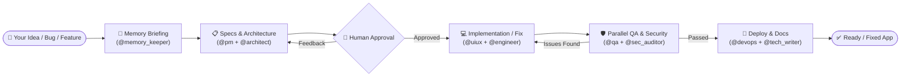
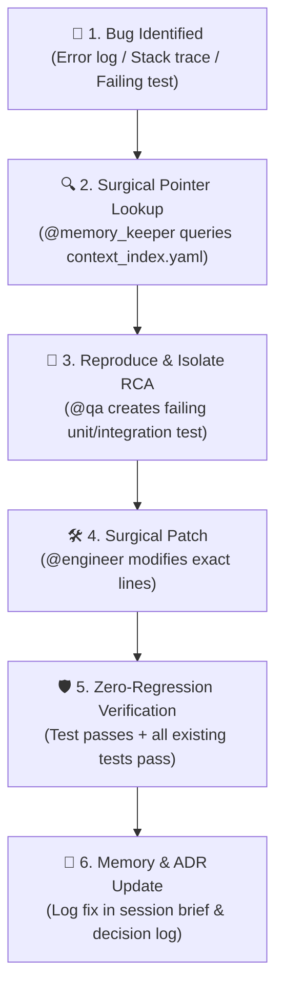

# 📘 Master Skills — Pipeline & Workflow User Guide

Welcome to the **Master_Skills Multi-Agent Development Pipeline**. This guide explains how to use this autonomous multi-agent framework to build, iterate, modify, troubleshoot, and deploy your software projects from inception to production.

---

## 📑 Table of Contents

1. [System Overview & How It Works](#1-system-overview--how-it-works)
2. [Quick Reference Cheat Sheet](#2-quick-reference-cheat-sheet)
3. [How to Start a New Project (`/startcycle`)](#3-how-to-start-a-new-project-startcycle)
4. [How to Add a Feature (`/iteratecycle`)](#4-how-to-add-a-feature-iteratecycle)
5. [How to Find, Diagnose & Solve Any Bug or Problem](#5-how-to-find-diagnose--solve-any-bug-or-problem)
6. [How to Make UI, Database & Configuration Changes](#6-how-to-make-ui-database--configuration-changes)
7. [The Human-in-the-Loop Approval Gates](#7-the-human-in-the-loop-approval-gates)
8. [Understanding the Memory Plane & Token Efficiency](#8-understanding-the-memory-plane--token-efficiency)
9. [Directory Structure & Where Things Live](#9-directory-structure--where-things-live)
10. [Best Practices & Pro Tips](#10-best-practices--pro-tips)

---

## 1. System Overview & How It Works

The Master_Skills pipeline operates as an **orchestrated team of 9 specialized AI personas** that collaborate sequentially across well-defined phases.

Instead of writing code in a single prompt without validation, the pipeline follows an enterprise software engineering lifecycle:



### The 9 Personas & Their Roles

| # | Persona | Name | Role & Responsibility |
|---|---|---|---|
| 1 | `@memory_keeper` | **Context Steward** | Retrieves indexed context, logs Architecture Decision Records (ADRs), maintains token budgets. |
| 2 | `@pm` | **Product Manager** | Writes Business Requirement Documents (BRDs), user stories, acceptance criteria. |
| 3 | `@architect` | **Systems Architect** | Designs database schemas (ERD), REST/GraphQL API contracts, tech stack choices. |
| 4 | `@uiux` | **UI/UX Strategist** | Creates design systems, color tokens, responsive component trees. |
| 5 | `@engineer` | **Full-Stack Engineer** | Implements clean, modular frontend and backend code matching API contracts. |
| 6 | `@qa` | **QA Engineer** | Validates business logic against specs, writes test suites, reproduces and verifies bugs. |
| 7 | `@sec_auditor` | **Security Auditor** | Scans for OWASP Top 10, SQL injection, XSS, insecure headers, and performance bottlenecks. |
| 8 | `@devops` | **DevOps Master** | Creates `Dockerfile`s, `docker-compose.yml`, Cloud Run manifests, and deployment scripts. |
| 9 | `@tech_writer` | **Technical Writer** | Generates comprehensive `README.md`, setup guides, and API documentation. |

---

## 2. Quick Reference Cheat Sheet

| Task / Goal | Command to Run | What Happens |
|---|---|---|
| **Start a brand new project** | `/startcycle <your idea>` | Greenfield workflow: Ideation ➔ Architecture ➔ UI/UX ➔ Code Generation ➔ QA/Security ➔ Deployment ➔ Docs. |
| **Add a new feature** | `/iteratecycle <feature description>` | Surgical workflow: Indexed memory lookup ➔ Feature spec ➔ Non-destructive incremental code ➔ Regression QA ➔ Sync blueprint. |
| **Find and fix a bug** | `/iteratecycle Fix <bug/error description>` | Targeted diagnosis: Locates root cause via index ➔ Writes reproducing test ➔ Fixes bug ➔ Regression check. |
| **Fix a runtime error / crash** | `/iteratecycle Fix crash: <paste stack trace>` | Stack-trace isolation: Maps stack trace to file & line ➔ Patches exception handler or missing check. |
| **Modify styles or UI** | `/iteratecycle Update UI: <details>` | UI/UX adjustment: Updates component styles/design tokens without touching business logic. |
| **Add database migration** | `/iteratecycle Add table/column: <details>` | Database update: Generates additive SQL migration script without dropping existing data. |
| **Deploy or containerize** | `/iteratecycle Prepare deployment for <target>` | DevOps generation: Generates Docker, Docker Compose, or GCP Cloud Run configs. |

> [!TIP]
> For a complete copy-paste library of specific prompts across SaaS, E-commerce, RAG, Auth, UI, Testing, and Cloud Run, see:  
> 👉 **[`docs/UNIVERSAL_PROMPTS.md`](file:///d:/TY-IT/Projects/Master_Skills/docs/UNIVERSAL_PROMPTS.md)**

---

## 3. How to Start a New Project (`/startcycle`)

Use `/startcycle` when you have a fresh idea or want to build a complete application from scratch.

### Step 1: Trigger the Workflow
Type the `/startcycle` command followed by a clear, high-level summary of what you want to build.

**Example Prompts:**
```text
/startcycle Build a modern Task Management SaaS with Kanban boards, team workspaces, JWT authentication, and PostgreSQL database.
```
```text
/startcycle Build an AI-powered Passport Application Tracking system with applicant verification, status timeline, and admin dashboard.
```

### Step 2: Phase 0 — Memory Briefing & Context Loading
- `@memory_keeper` loads the context index (`memory/context_index.yaml`) and verifies open ADRs and previous session briefs.
- Creates a scoped context packet (capped at 4,000 tokens) to ensure the agent does not suffer from context bloat.

### Step 3: Phase 1 — Specification & Architecture (Human Approval Gate 1 & 2)
1. **Product Management (`@pm`)**: 
   - Produces a comprehensive **Business Requirements Document (BRD)** in `artifacts/task_lists/Master_Blueprint.md`.
   - Outlines user stories, acceptance criteria, and edge cases.
   - **Pause for User Review**: The assistant will present the BRD and ask for your approval.
   - *Action for you*: Type **`Approved`** to proceed, or provide feedback (e.g., *"Please add role-based access for Managers and Viewers"*).
2. **Systems Architecture (`@architect`)**:
   - Generates the **Entity-Relationship Diagram (ERD)**, **API Contracts**, and **Technology Stack Blueprint**.
   - **Pause for User Review**: The assistant pauses for your approval of the technical foundation.
   - *Action for you*: Type **`Approved`** to start coding.

### Step 4: Phase 2 — Implementation & Code Generation
- **UI/UX Design (`@uiux`)**: Generates design tokens, layout hierarchy, and component trees in `docs/`.
- **Full-Stack Engineering (`@engineer`)**: Generates production-grade code:
  - Database schema & seed scripts (`database/`)
  - Backend API services & controllers (`services/` or backend framework)
  - Frontend client components and state management (`frontend/`)

### Step 5: Phase 3 — Parallel QA & Security Auditing
- **QA Engineer (`@qa`)**: Writes unit/integration tests and validates edge cases.
- **Security Auditor (`@sec_auditor`)**: Scans code for vulnerabilities, injection vectors, and performance bottlenecks.
- *Self-Healing Loop*: If any critical bug or vulnerability is detected, the pipeline automatically hands the code back to `@engineer` to fix it before proceeding.

### Step 6: Phase 4 — Delivery & Documentation
- **DevOps Master (`@devops`)**: Generates container configurations (`Dockerfile`, `docker-compose.yml`) and Cloud Run deployment scripts.
- **Technical Writer (`@tech_writer`)**: Creates an end-to-end `README.md`, setup instructions, and API references.
- **Memory Steward (`@memory_keeper`)**: Compresses session memory, updates `memory/decision_log.md` with ADRs, and indexes all generated files in `memory/context_index.yaml`.

---

## 4. How to Add a Feature (`/iteratecycle`)

Use `/iteratecycle` whenever your base project is established and you want to add new capabilities **without breaking or rewriting existing code**.

### Step 1: Trigger the Workflow
Type `/iteratecycle` followed by the feature description.

**Example Prompts:**
```text
/iteratecycle Add Google OAuth2 social login and user profile avatar image upload to the existing user service.
```
```text
/iteratecycle Add PDF export functionality for the applicant passport status reports.
```

### Step 2: How the Surgical Pipeline Executes

1. **Indexed Memory Briefing (`@memory_keeper`)**:
   - Searches `memory/context_index.yaml` by keywords (e.g., `auth`, `user_profile`, `pdf`).
   - Retrieves **only the relevant file pointers and ADRs** — eliminating the need to re-read the entire repository.
2. **Impact Analysis & Feature Spec (`@pm` + `@architect`)**:
   - Generates `artifacts/task_lists/Feature_Update_Spec.md`.
   - Pinpoints the exact files to modify and new endpoints to introduce.
   - Preserves backward compatibility (e.g., bumps API routes or adds optional schema columns).
   - **Pause for User Review**: You review and type `Approved`.
3. **Surgical Implementation (`@engineer`)**:
   - **Strict Non-Destructive Rule**: Modifies only target files.
   - Creates additive database migrations (never drops tables).
   - Checks `memory/cache/` for existing boilerplate.
4. **Regression & Security Check (`@qa` + `@sec_auditor`)**:
   - QA validates that previously existing routes still function 100% as expected (Zero-Regression guarantee).
   - Security scans newly introduced endpoints.
5. **Blueprint & Memory Synchronization**:
   - Updates `artifacts/task_lists/Master_Blueprint.md` and documentation.
   - Logs the new architectural decision in `memory/decision_log.md`.

---

## 5. How to Find, Diagnose & Solve Any Bug or Problem

When something breaks, returns unexpected data, throws an error, or crashes, the pipeline provides a deterministic **Root Cause Analysis (RCA) and Problem-Solving Protocol**.



### The 6-Step Problem-Solving Protocol

#### Step 1: Reporting the Bug to the Pipeline
Trigger `/iteratecycle` with clear symptom details:
- **What happened** (the actual behavior or error code).
- **What was expected** (the intended behavior).
- **The error message / stack trace** (if available).

```text
/iteratecycle Fix: When submitting a passport application without an optional middle name, the backend returns HTTP 500 with 'TypeError: Cannot read properties of undefined'.
```

#### Step 2: Surgical Location via Context Index (`@memory_keeper`)
- Instead of scanning the whole repo, `@memory_keeper` extracts keywords (`passport`, `application`, `submission`, `validation`) from the error report.
- It pulls the exact file and line ranges from `memory/context_index.yaml` (e.g., `services/applicant_service.js` lines 42-65).

#### Step 3: Root Cause Analysis & Reproduction (`@qa`)
- `@qa` writes an automated regression test in `app_build/tests/` reproducing the exact failure before any code is edited.
- The test verifies that the failure is reproducible and isolates whether the problem is:
  - **Data validation** (missing null check, invalid payload).
  - **Database constraint** (foreign key violation, missing default).
  - **Async/race condition** (unhandled Promise, missing `await`).
  - **CORS/Network** (missing HTTP headers, blocked origins).

#### Step 4: Surgical Patching (`@engineer`)
- `@engineer` modifies **only the offending lines of code**.
- No full-file rewrites. Unrelated functions, imports, and comments remain untouched.

#### Step 5: Parallel Verification & Zero-Regression (`@qa` + `@sec_auditor`)
- The new test is executed: **it must now pass**.
- The entire existing test suite is executed: **no regressions permitted**.
- `@sec_auditor` scans the patch to ensure the fix did not open new vulnerabilities (e.g. bypassing input sanitization to fix a type error).

#### Step 6: Memory Commit (`@memory_keeper`)
- Emits a session brief recording the root cause and the fix.
- If the fix changes a fundamental contract, logs an ADR to `memory/decision_log.md`.
- Updates line pointers and content hashes in `memory/context_index.yaml`.

---

### Diagnosing Common Problem Archetypes

| Problem Archetype | Common Root Cause | How to Prompt the Pipeline |
|---|---|---|
| **HTTP 500 / Unhandled Crash** | Null/undefined access, missing error handler, unhandled Promise rejection. | `/iteratecycle Fix 500 error on [ENDPOINT]: [paste error stack trace]` |
| **HTTP 400 / 422 Bad Request** | Request body does not match validation schema (Zod/Joi/DTO mismatch). | `/iteratecycle Fix validation schema error on [ENDPOINT] when payload has [FIELD]` |
| **CORS / Network Block** | Backend missing `Access-Control-Allow-Origin` or allowed methods/headers. | `/iteratecycle Fix CORS error between frontend [PORT] and backend [PORT]` |
| **Database Constraint Error** | Foreign key violation, unique constraint conflict, missing column in migration. | `/iteratecycle Fix SQL constraint error when inserting into [TABLE]: [error]` |
| **Frontend State / Blank Screen** | Undefined prop access, infinite `useEffect` loop, stale closure. | `/iteratecycle Fix frontend blank screen on page [PATH]: [console log output]` |
| **Docker / Build Failure** | Missing dependency in `package.json`, wrong build stage, port already in use. | `/iteratecycle Fix Docker build failure: [paste terminal build output]` |

---

## 6. How to Make UI, Database & Configuration Changes

You can ask the pipeline to make surgical changes to specific layers of your application at any time.

### A. Updating UI / Design & Styles
```text
/iteratecycle Update frontend theme to a dark mode palette with indigo accents and smooth button hover animations.
```
*What the pipeline does:*
- `@uiux` updates tokens in `docs/design_system.md`.
- `@engineer` updates CSS variables and component styling.
- Backend and database remain untouched.

### B. Database Schema Modifications (Additive Migrations)
```text
/iteratecycle Add an 'is_verified' boolean column (default false) and 'verified_at' timestamp to the users table.
```
*What the pipeline does:*
- `@architect` designs the migration script without dropping existing tables.
- `@engineer` adds an incremental migration in `database/migrations/` and updates backend models.

### C. Environment & Configuration Updates
```text
/iteratecycle Configure Redis caching for the GET /api/v1/applications endpoint with a 60-second TTL.
```
*What the pipeline does:*
- Updates `.env.example` with Redis host/port variables.
- Implements caching middleware in the backend service.
- Adds Redis service block to `production_artifacts/docker-compose.yml`.

---

## 7. The Human-in-the-Loop Approval Gates

The pipeline is built with deterministic human validation gates. You maintain full strategic control while the AI handles the execution heavy lifting.

```
[Agent generates Spec / Plan]
             │
             ▼
     ┌───────────────┐
     │  PAUSE GATE   │  <-- Agent halts and asks for your input
     └───────┬───────┘
             │
     ┌───────┴───────┐
     │               │
     ▼               ▼
 "Approved"     "Change X to Y"
     │               │
     ▼               ▼
[Proceeds to    [Agent revises
 next phase]     and re-prompts]
```

### How to Respond at Approval Gates:

- **To proceed immediately:**
  > `Approved` (or `Looks good, proceed!`)
- **To request adjustments:**
  > `Please change the database from PostgreSQL to SQLite for local development.`  
  > `Include support for Stripe subscriptions in the billing user stories.`
- **To ask a clarifying question:**
  > `Why did the architect select WebSockets instead of SSE for notifications?`

---

## 8. Understanding the Memory Plane & Token Efficiency

The v2.0 framework uses a dedicated **Memory Plane** (`memory/`) to ensure fast, token-efficient, and context-aware iterations.

```
memory/
├── context_index.yaml     <-- Keyword index to files, line ranges, and summaries
├── decision_log.md        <-- Architecture Decision Records (ADRs)
├── session_briefs/        <-- Short digests (≤300 tokens) of past agent steps
├── token_ledger.csv       <-- Token consumption auditing
└── cache/                 <-- Reusable templates & boilerplate
```

### Key Memory Mechanisms:
1. **Indexed Retrieval vs Full Re-reads**:
   - Instead of reading 1,000+ lines of codebase on every prompt, the Context Steward queries `memory/context_index.yaml` and extracts only the lines relevant to your prompt.
2. **Architecture Decision Records (ADRs)**:
   - Kept in `memory/decision_log.md`. Records all key decisions (e.g., "ADR-002: Use Tailwind-free Vanilla CSS for UI flexibility").
   - Ensures the AI never contradicts past architectural decisions in future cycles.
3. **Semantic Cache (`memory/cache/`)**:
   - Stores standardized boilerplate (Dockerfiles, CRUD skeletons, CI workflows) to avoid regenerating identical code.

---

## 9. Directory Structure & Where Things Live

| Plane | Directory | Description & Contents |
|---|---|---|
| **Control Plane** | [`.agents/`](file:///d:/TY-IT/Projects/Master_Skills/.agents) | Persona definitions ([`agents.md`](file:///d:/TY-IT/Projects/Master_Skills/.agents/agents.md)), skill playbooks, and workflow runners. |
| **Memory Plane** | [`memory/`](file:///d:/TY-IT/Projects/Master_Skills/memory) | Context index ([`context_index.yaml`](file:///d:/TY-IT/Projects/Master_Skills/memory/context_index.yaml)), ADRs ([`decision_log.md`](file:///d:/TY-IT/Projects/Master_Skills/memory/decision_log.md)), session briefs, and token audit ledger. |
| **Artifact Plane** | [`artifacts/`](file:///d:/TY-IT/Projects/Master_Skills/artifacts) | Living specifications ([`Master_Blueprint.md`](file:///d:/TY-IT/Projects/Master_Skills/artifacts/task_lists/Master_Blueprint.md)), audit logs, and test results. |
| **Design Plane** | [`docs/`](file:///d:/TY-IT/Projects/Master_Skills/docs) | Design system, visual guidelines, component trees, and technical user manuals. |
| **Frontend Plane** | [`frontend/`](file:///d:/TY-IT/Projects/Master_Skills/frontend) | Client application source code (HTML/CSS/JS, React, Vue, or modern frontend components). |
| **Services Plane** | `services/` | Backend microservices, controllers, domain models, and business logic. |
| **Database Plane** | `database/` | Database schema migrations, table constraints, seeds, and SQL procedures. |
| **Build & Test Plane**| `app_build/` | Automated QA test suites, lint configs, and validation scripts. |
| **DevOps Plane** | `production_artifacts/`| `Dockerfile`, `docker-compose.yml`, Nginx configs, and GCP deployment manifests. |

---

## 10. Best Practices & Pro Tips

1. **Be Specific in Feature & Bug Requests**:
   - ✅ *Good:* `/iteratecycle Fix 500 error in POST /api/v1/auth/login when email contains uppercase characters.`
   - ❌ *Vague:* `/iteratecycle Login is broken.`
2. **Include Error Logs or Stack Traces**:
   - Always paste the exact error line or terminal output into the `/iteratecycle` prompt. The agent uses this to map immediately to the exact file and line number.
3. **Trust the Phased Execution**:
   - Let the `@pm` and `@architect` formulate the plan before asking for code. A strong specification prevents 90% of implementation bugs.
4. **Use the Right Command for the Job**:
   - Use `/startcycle` **only once** at the beginning of a new project.
   - Use `/iteratecycle` for **all subsequent features, changes, refactors, and bug fixes**.
5. **Inspect the Artifacts & Logs**:
   - Check [`artifacts/task_lists/Master_Blueprint.md`](file:///d:/TY-IT/Projects/Master_Skills/artifacts/task_lists/Master_Blueprint.md) anytime to see the active system state.
   - Check [`artifacts/audit_report.md`](file:///d:/TY-IT/Projects/Master_Skills/artifacts) to view security and QA test reports.
   - Check [`memory/decision_log.md`](file:///d:/TY-IT/Projects/Master_Skills/memory/decision_log.md) to review past architectural decisions.
